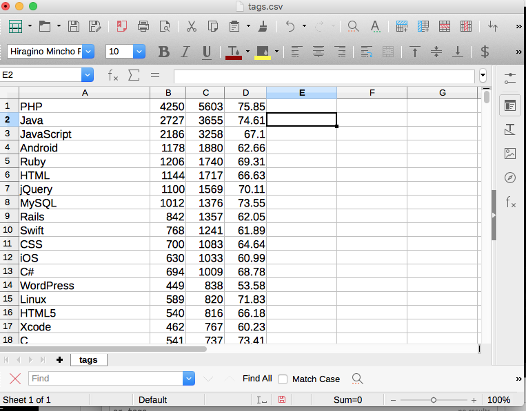

    $ bundle install

teratail の API トークンを環境変数に設定します。

    $ export TERATAIL=xxxxx

teratail からデータをダウンロードして、tag 毎の質問数、解決数、解決率を集計します。

    $ ruby download.rb
    $ ruby app/update_db.rb
    $ ruby app/app.rb > tags.csv

csv を openoffice などで開きます。

    $ open 1.csv

download.rb は、データ取得をする開始ページとページ数を設定している変数があります。
現状では 一時間中に取得できるのは300 ページまでです。（1 ページは 100 件)  
適宜、スタートページを調整して、1 時間の間隔をおいてから操作をすることで全データを取得できます。

[CSVの例](tags.csv)  

openofffice で開いてから質問数で降順ソート   
